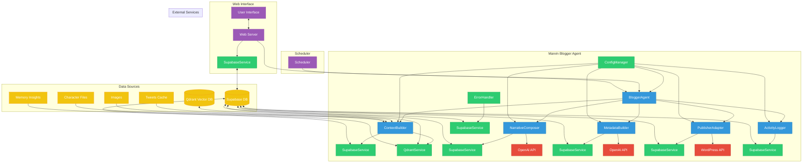

# Marvin Blogger System Architecture

The following diagram illustrates the architecture of the Marvin Blogger system, showing the key components and their interactions.

## Component Descriptions

### Core Components

- **BloggerAgent**: The main controller class that orchestrates the blog post generation process
- **ContextBuilder**: Gathers content from various sources to build context for blog generation
- **NarrativeComposer**: Transforms context into coherent narrative content using OpenAI
- **MetadataBuilder**: Creates tags, categories, and other metadata for the blog post
- **PublisherAdapter**: Handles saving content to the database and publishing to external platforms
- **ActivityLogger**: Tracks all system activities for monitoring and debugging
- **ConfigManager**: Manages configuration settings and environment variables
- **ErrorHandler**: Provides robust error management to ensure system stability
- **ServiceContainer**: Dependency injection container (not shown in diagram for clarity)

### Data Services

- **SupabaseService**: Interface to the Supabase database for data storage and retrieval
- **QdrantService**: Interface to the Qdrant vector database for semantic search and retrieval

### Data Sources

- **Supabase DB**: PostgreSQL database storing blog posts, tweets, images, character files, etc.
- **Qdrant Vector DB**: Vector database storing embeddings for memory insights
- **Tweets Cache**: Collection of recent tweets used as input for blog generation
- **Images**: Collection of images with associated metadata
- **Character Files**: Character information defining Marvin's voice and personality
- **Memory Insights**: Contextual information retrieved from the vector database

### Web Interface

- **Web Server**: Express.js server providing a web interface for viewing and creating blog posts
- **User Interface**: Browser-based UI for interacting with the system

### External Services

- **OpenAI API**: Used for generating blog content and metadata
- **WordPress API**: Optional integration for publishing blog posts to WordPress

## Data Flow

1. The process begins either through the scheduler (every 6 hours) or via the web interface
2. BloggerAgent orchestrates the entire process
3. ContextBuilder gathers tweets, images, character information, and memory insights
4. NarrativeComposer uses this context to generate blog content via OpenAI
5. MetadataBuilder creates appropriate metadata for the blog post
6. PublisherAdapter saves the blog post to the database and optionally publishes it
7. ActivityLogger records the activity for monitoring purposes

## Key Features

- **Multi-source Integration**: Combines tweets, images, character information, and memory insights
- **Sophisticated Content Generation**: Uses OpenAI with character-specific prompts
- **Robust Error Handling**: Comprehensive error management with logging
- **Flexible Configuration**: Configurable through environment variables
- **Web Interface**: User-friendly interface for viewing and creating blog posts
- **Scheduled Operation**: Automatic blog post generation on a schedule
